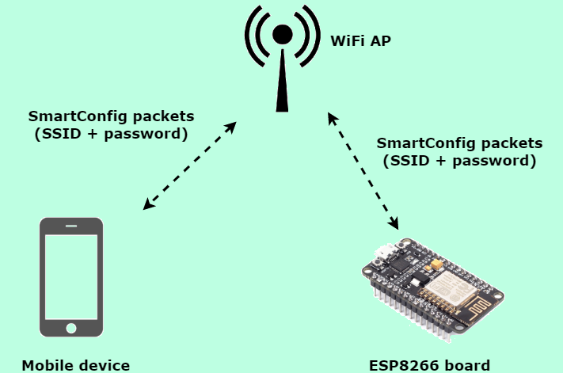
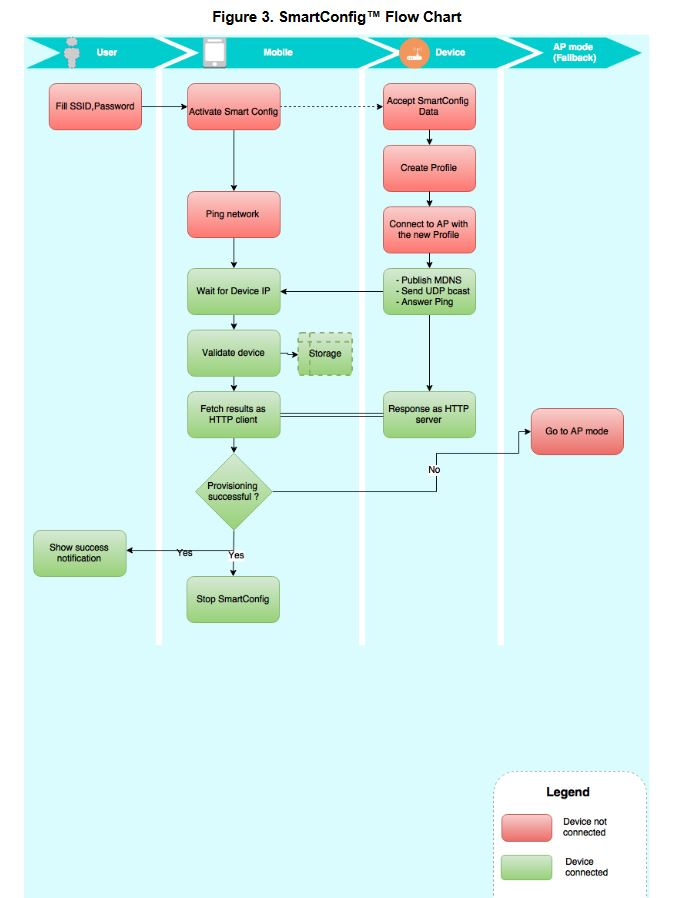

# Smart config

### What is smart config ?
- Helping for connect device wifi to wifi access point over smartphone.
- That's mean, we don't need to update firmware device when the wifi change the configuration. Just use the smartphone and send UDP to device and connect.

### Condition for using smart config
- The IOT device has ESP8266 or CC3000 or RN131 or HDG204. But ESP8266 is a best choice.
- Smart phone using ESPTouch to send wifi configuration info to device

### How it work ?
- First time, the IOT device is not connect to wifi, user need bring the IOT device into smartconfig mode.
- When device in smartconfig mode, it's will loop to listen the data from ESP-Touch
- ESP-Touch is a protocol that help mobile to connect to ESP8266 and send UDP data
- When user use Smart phone has installed app ESP-Touch and send wifi configuration info (UDP) to Access point (it's ESP8266).
- When the IOT device receive the data, it would decrypt the data and connect to wifi.
- After that, IOT device exit smart config mode.

### Flow Diagram

### Source smartconfig for IOT Device
- [arduino](https://github.com/espressif/arduino-esp32)

### Source ESP Touch for Android
- [ESPTouch](https://github.com/EspressifApp/EsptouchForAndroid)